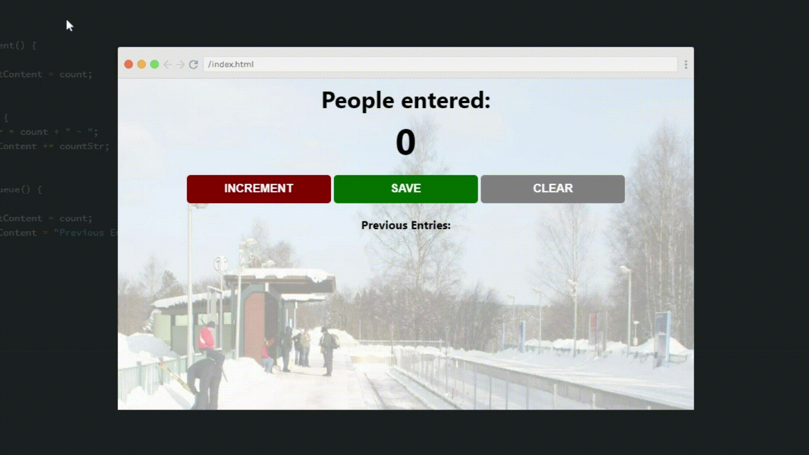

# Passenger Counter

- 🛳️ Simple JavaScript application — using the onclick event to modify HTML structure. 
- 🚶‍♂️This app enables a worker at a train station, whose job is to count the number of passengers, to do successfully do so by the ability to increment, save, and clear the number of passengers.

## Demo

